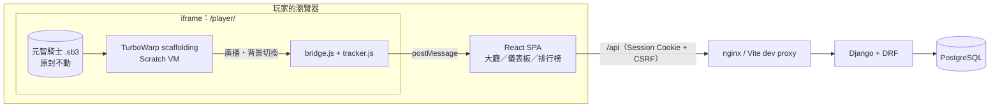

# 系統架構

## 總覽



- **前端**：React 18 + TypeScript + Vite + Tailwind CSS 4 + React Router + TanStack Query + Recharts。
- **後端**：Django 5.2 LTS + Django REST Framework，PostgreSQL 16。
- **同源部署**：開發時由 Vite、正式環境由 nginx 把 `/api` 反向代理到 Django，所以瀏覽器看到的前端與 API 是同一個來源。
  因此採用 **HttpOnly Session Cookie + CSRF**，不需要 CORS，也不必把 JWT 放在 `localStorage`（XSS 時會被偷走）。

## 原本的 Scratch 遊戲長什麼樣

分析對象：<https://scratch.mit.edu/projects/731822830>《元智騎士 v1.2》（84 個角色、434 個素材、無擴充功能）。

| 項目 | 內容 |
| --- | --- |
| 類型 | 俯視射擊 Roguelike + 日文助詞選擇題 |
| 學習內容 | も・は・が・で・に・から・まで（含「不需要助詞」），共 75 題，取材自《みんなの日本語》 |
| 結構 | 2 章 ×（5 關 + 1 魔王）＝ 12 關。第一章每關 1 題、第二章每關 2 題、魔王戰 5 題 |
| 題目 | 文字寫在 `Tree`／`BOSS` 角色的「說」積木裡；中文提示在 `提示按鈕` |
| 選項 | 每個選項是一個角色，正解角色的名稱以 `(正解)` 開頭 |
| 重要廣播 | `回答正確`、`回答錯誤`、`答題成功`（過關）、`擊倒魔王`、`評價`（結算） |
| 重要狀態 | 舞台背景名稱＝關卡代號（`1-1`…`2-X`、`THE END`、`GAME OVER`）；清單 `題目` 第 1 項＝目前題號 |

## Scratch 整合：四種做法的比較

「把遊戲顯示在網頁上」和「網頁能跟遊戲交換資料」是兩件事。

| 做法 | 能顯示 | 能交換資料 | 結論 |
| --- | --- | --- | --- |
| Scratch 官方嵌入 `scratch.mit.edu/projects/…/embed` | ✅ | ❌ 跨來源 iframe，外層讀不到任何變數，Scratch 也沒有提供 postMessage API | 不採用 |
| TurboWarp 官方嵌入 `turbowarp.org/…/embed` | ✅ | ❌ 一樣是跨來源 | 不採用 |
| 自訂 Scratch 擴充功能（在專案裡加「送出事件」積木） | ✅ | ✅ | 可行，但要修改原專案、官方 Scratch 無法載入未沙箱化的擴充；留作未來選項 |
| **自行託管 `@turbowarp/scaffolding` + JavaScript Bridge** | ✅ | ✅ | **採用** |

採用的做法：`frontend/public/player/` 是一個獨立的靜態頁面，用 npm 套件
[`@turbowarp/scaffolding`](https://github.com/TurboWarp/scaffolding)（TurboWarp Packager 的執行核心）載入 `.sb3`。
因為是我們自己的頁面在跑 VM，拿得到 `scaffolding.vm`，於是可以**完全不改原專案**地觀察遊戲：

- **廣播**：Scratch VM 沒有「收到廣播」的公開事件，但所有帽子積木都經由 `runtime.startHats()` 啟動。
  `bridge.js` 包住這個方法（只讀取、照常呼叫原方法）來得知 `回答正確` 等廣播。
- **背景切換**：監聽 `runtime` 的 `AFTER_EXECUTE` 事件，每個影格讀取舞台目前的造型名稱。
- **題號／玩家選項**：讀取清單 `題目` 第 1 項；發出廣播的執行緒所屬角色就是玩家點的選項。

`tracker.js` 是一個不依賴瀏覽器的狀態機，把上述觀察結果翻譯成標準事件；每款遊戲的對應規則寫在
`scratch-games/integrations/<slug>/adapter.json`。

已知限制：`runtime.startHats` 與 `sequencer.activeThread` 屬於 VM 內部介面而非正式 API，
所以 `@turbowarp/scaffolding` 鎖定確切版本（0.4.0），升級時需重跑 `tracker` 測試並實機確認。

### 標準事件（播放器 → React）

```jsonc
{ "source": "nihongo-quest-game", "version": 1, "game": "yuanze-knight", "type": "...", "payload": { } }
```

| type | payload | 何時發出（元智騎士） |
| --- | --- | --- |
| `PLAYER_READY` | `{}` | .sb3 載入完成 |
| `GAME_STARTED` | `{}` | 背景切到 `1-1`（新的一局） |
| `LEVEL_STARTED` | `{level_key}` | 背景切到某一關 |
| `QUESTION_ANSWERED` | `{level_key, question_key, choice, is_correct}` | 廣播 `回答正確`／`回答錯誤` |
| `LEVEL_COMPLETED` | `{level_key}` | 廣播 `答題成功`／`擊倒魔王` |
| `GAME_FINISHED` | `{outcome: cleared｜failed, battle_score}` | 背景切到 `THE END`／`GAME OVER` |
| `GAME_ERROR` | `{message}` | 載入或橋接層發生錯誤 |

遊戲工作階段（session）由 React 在收到 `GAME_STARTED` 時向後端建立，事件序號也由 React 依序編號，
所以遊戲端不需要知道任何後端的識別碼。

React 端（`features/game/protocol.ts`）收到訊息時會檢查三件事才採用：
`event.origin` 是允許的來源、`event.source` 是我們嵌入的那個 iframe、內容通過 zod schema。

## 信任模型：哪些資料可信

遊戲在玩家的瀏覽器裡執行，**玩家可以修改任何從瀏覽器送出的資料**。
`postMessage` 的 origin 檢查只能擋掉「別的網站／別的 iframe」，擋不了玩家本人，所以它不是防作弊機制。

| 資料 | 來源 | 可信程度 |
| --- | --- | --- |
| 帳號、暱稱、隱私設定 | 後端驗證 | 可信 |
| EXP、等級 | **只由後端**依 `GameLevel.exp_reward` 計算；前端送任何數值都不採用 | 金額可信；「是否真的過關」見下 |
| 答題對錯 | 遊戲回報玩家點了哪個選項，後端用自己的題庫判定對錯（`verified=true`） | 判定可信；「點了哪個選項」不可驗證 |
| 過關事件 | 遊戲回報，後端檢查順序、答對題數、最短耗時、重複 | **不可完全信任**：能擋住重送與亂送，擋不住精心偽造 |
| 答題評價（排行榜） | 後端依收到的作答計算 | 同上 |
| 戰鬥評價（排行榜） | 遊戲變數，後端只做範圍限制 | 不可信，介面上有註明 |

已實作的防護：

- 事件帶序號，後端以資料列鎖（`SELECT … FOR UPDATE`）依序處理，重送或並發都不會重複計算。
- `ExperienceTransaction.learning_record` 是 One-to-One：同一筆關卡紀錄在資料庫層級就只能有一筆獎勵。
- 過關需要：關卡已開始、答對題數足夠、耗時不低於 `min_seconds`、前一關已在同一局完成。
- 重玩已通關的關卡只給三成 EXP；事件端點有獨立的限流。

要讓排行榜真正可信，必須把**出題與判定搬到後端**（由後端抽題、驗答、推進關卡），這等於改寫遊戲的答題流程，
與「優先保留原本的 Scratch 專案」衝突，所以目前定位為：**學習紀錄用途足夠可信，排行榜為榮譽制**。

## 加入新的 Scratch 遊戲

1. `python3 scratch-games/tools/fetch_sb3.py <專案ID> scratch-games/original/<名稱>.sb3`
2. 觀察專案用哪些廣播／背景代表「開始、作答、過關、結束」，寫成 `scratch-games/integrations/<slug>/adapter.json`
   （欄位說明見 `scratch-games/integrations/README.md`）。
3. 在 `backend/apps/games/seed/` 新增 `<slug>.json`（遊戲、關卡、EXP）與題庫檔，執行 `python manage.py seed_games`。
4. 重新啟動前端（`sync-game-assets` 會把檔案複製到 `public/games/<slug>/`）。

會員、EXP、學習紀錄、儀表板與排行榜都是跨遊戲共用的，不需要再改程式。
如果新遊戲的事件模式無法用現有欄位描述，再擴充 `tracker.js`。

## 目錄

```
backend/            Django 專案
  config/           設定、URL
  apps/common/      回應信封、例外處理、分頁
  apps/accounts/    User、PlayerProfile、註冊登入
  apps/games/       Game、GameLevel、Question、種子資料
  apps/learning/    GameSession、LearningRecord、QuestionAttempt、事件處理
  apps/gamification/ ExperienceTransaction、等級規則、儀表板與排行榜統計
frontend/
  public/player/    Scratch 播放器與橋接層（純靜態、原生 JS）
  src/features/     auth（登入狀態）、game（訊息協定、事件佇列）
  src/pages/        各頁面
scratch-games/
  original/         原始 .sb3（不修改）
  integrations/     各遊戲的 adapter.json
  tools/            下載 .sb3、抽題庫的腳本
```
