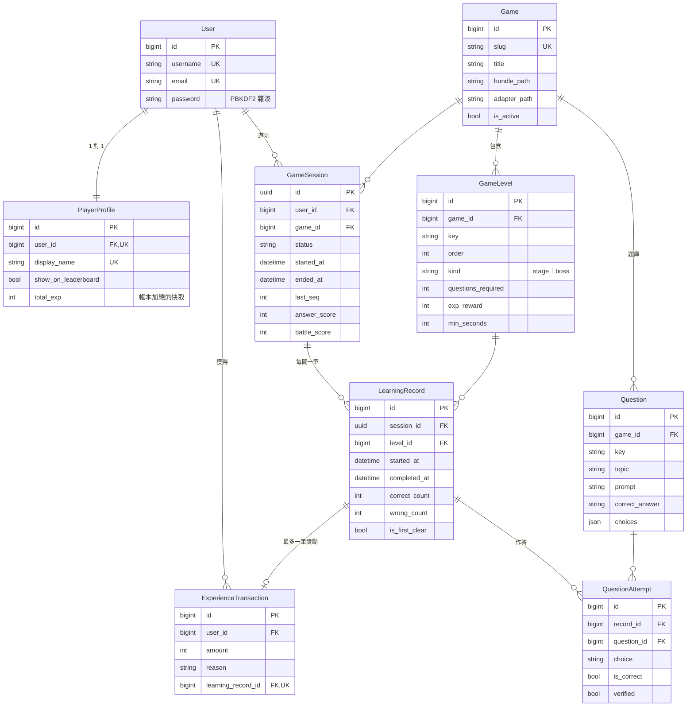

# 資料庫設計

PostgreSQL 16，全部以 Django ORM 定義（`backend/apps/*/models.py`），結構變更一律走 migration。

## ERD

## 關聯

| 關聯 | 類型 | 刪除行為 |
| --- | --- | --- |
| PlayerProfile → User | One-to-One | CASCADE |
| GameLevel／Question → Game | Many-to-One | CASCADE |
| GameSession → User | Many-to-One | CASCADE |
| GameSession → Game | Many-to-One | PROTECT（有紀錄的遊戲不能刪） |
| LearningRecord → GameSession | Many-to-One | CASCADE |
| LearningRecord → GameLevel | Many-to-One | PROTECT |
| QuestionAttempt → LearningRecord | Many-to-One | CASCADE |
| QuestionAttempt → Question | Many-to-One | PROTECT |
| ExperienceTransaction → User | Many-to-One | CASCADE |
| ExperienceTransaction → LearningRecord | One-to-One（可為空） | PROTECT |

## 唯一限制與完整性限制

| 資料表 | 限制 | 目的 |
| --- | --- | --- |
| User | `username`、`email` 唯一 | 帳號不重複 |
| PlayerProfile | `user` 唯一、`display_name` 唯一 | 一人一個身分、暱稱不撞名 |
| Game | `slug` 唯一 | |
| GameLevel | `(game, key)`、`(game, order)` 唯一；`questions_required ≥ 1` | 關卡代號與順序不重複 |
| Question | `(game, key)` 唯一 | |
| GameSession | `ended_at ≥ started_at`；`(user, game)` 在 `status='in_progress'` 時唯一（部分唯一索引） | 同一人同一遊戲只有一局進行中 |
| LearningRecord | `(session, level)` 唯一 | 一局中一關只有一筆紀錄 |
| ExperienceTransaction | `learning_record` 唯一；`amount > 0`；`reason='level_clear'` 時必須有 `learning_record` | **同一筆通關不可能重複發獎** |

## 索引

| 索引 | 用途 |
| --- | --- |
| `session_user_recent_idx (user, -started_at)` | 最近遊玩紀錄 |
| `session_game_status_idx (game, status)` | 最高評價排行榜 |
| `record_level_done_idx (level, completed_at)` | 關卡完成率、是否首次通關 |
| `attempt_question_result_idx (question, is_correct)` | 最常答錯的題目 |
| `exp_user_recent_idx (user, -created_at)` | 經驗值紀錄、每日成長 |
| `profile_exp_rank_idx (-total_exp, id) WHERE show_on_leaderboard` | EXP 排行榜 |
| `Question.topic` | 各助詞正確率 |

## 避免互相矛盾的資料

- **等級不存資料庫**：一律由 `total_exp` 用 `gamification/leveling.py` 推算。
- **`PlayerProfile.total_exp`** 是 `ExperienceTransaction` 加總的快取，只會在 `award_level_clear()` 的同一筆交易內、
  鎖住 profile 資料列後更新；帳本才是事實來源。
- **`LearningRecord`** 不重複儲存 user／game（由 session 推得），EXP 也不存在紀錄上（由帳本關聯取得）。
- **`correct_count`／`wrong_count`** 是該關作答的計數快取，與新增 `QuestionAttempt` 在同一筆交易內更新，過關後不再變動。
- **`GameSession.answer_score`** 在結束時由後端依作答紀錄計算一次。
