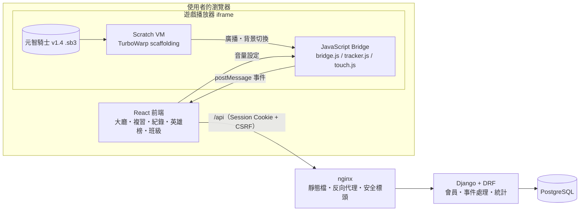
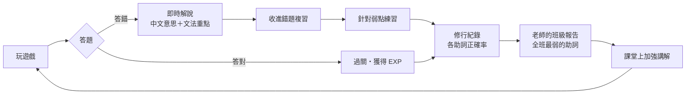
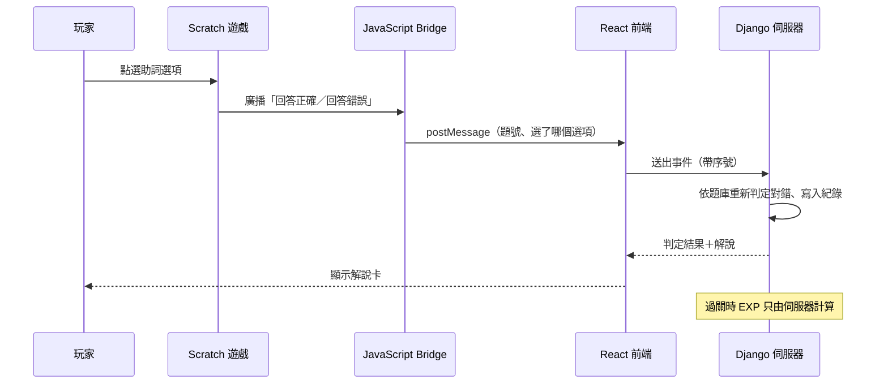

# Nihongo Quest — 日文冒險學習平台｜專題成果總覽

> 這份文件整理專題到目前為止（v0.4.0）做了什麼、怎麼做的、遇到什麼問題、怎麼解決。
> 用途：製作備審資料與圖片的素材庫。每一節都可以獨立取用；第 12 節列出建議製作的圖。
>
> - 線上版：<https://nihongo-quest-7a5m.onrender.com>（免費方案，閒置 15 分鐘後會休眠，喚醒約 1 分鐘）
> - 原始碼：<https://github.com/MINNNNNNN9/nihongo-quest>（分支 `release/v0.4.0`）
> - 詳細技術文件：[architecture.md](architecture.md)、[database.md](database.md)、[api.md](api.md)、[deployment.md](deployment.md)

---

## 1. 一句話介紹

把一款只能單機玩的 Scratch 日文助詞遊戲《元智騎士》，擴充成有會員、學習紀錄、錯題複習、班級管理與雲端部署的完整 Web 學習平台。

## 2. 動機與要解決的問題

| 原本的狀況 | 造成的問題 |
| --- | --- |
| 遊戲放在 Scratch 網站上，沒有帳號與紀錄 | 玩完就結束，學生和老師都不知道哪個助詞常錯 |
| 答錯只顯示「答錯了」 | 沒有解說，錯的題目不會再練到 |
| 題目泡泡 10 秒後消失 | 還沒看完題目就不見，只剩選項 |
| 12 個關卡的戰鬥完全相同 | 玩兩三關就膩，沒有動機繼續 |
| 只支援鍵盤滑鼠 | 手機、平板無法使用 |
| 沒有老師端 | 無法用在課堂上追蹤全班狀況 |

**核心想法**：遊戲負責「讓人想玩」，平台負責「讓練習留下紀錄並回饋到學習」。

## 3. 系統架構

| 層 | 技術 |
| --- | --- |
| 前端 | React 18、TypeScript、Vite、Tailwind CSS 4、TanStack Query、Recharts、zod |
| 後端 | Python 3.12、Django 5.2、Django REST Framework、drf-spectacular |
| 資料庫 | PostgreSQL 16（雲端使用 Neon） |
| 遊戲 | Scratch 3 專案 + `@turbowarp/scaffolding`（自行託管的 Scratch 執行環境） |
| 部署 | Docker、Docker Compose、nginx、gunicorn、Render、Cloudflare Tunnel |
| 測試與 CI | pytest-django、Vitest、React Testing Library、GitHub Actions |

## 4. 功能總覽

### 學生

- **冒險大廳**：等級、經驗值、今日任務、連續學習天數、遊戲入口。
- **遊戲**：在網頁中直接玩《元智騎士》，3 章 18 關；可調音量、全螢幕；手機有虛擬搖桿。
- **作答解說**：在遊戲裡每答一題，旁邊即時顯示句子、中文意思、正解與文法重點（答錯時先給提示，可再試一次）。
- **錯題複習**：不用進遊戲的小測驗，答錯過的題目優先出現，可指定助詞練習。
- **修行紀錄**：各助詞正確率、經驗值成長、最常答錯的題目、各關完成率、成就。
- **英雄榜**：累積 EXP、通過關卡數、全破評價三種排行；可選擇不公開。
- **假名標註**：所有題目的漢字都標了假名，可隨時開關。
- **帳號**：註冊、登入、修改資料與密碼、忘記密碼（寄信重設）。

### 老師

- **建立班級**：產生 6 碼加入代碼，學生輸入即可加入。
- **班級報告**：全班各助詞正確率、最常答錯的題目、學生名單（等級、作答數、正確率、最後練習時間）。
- **班級排行榜**。

### 管理員

- **後台**（`/admin/`）：建立老師帳號、重設使用者密碼、檢視所有紀錄；外觀與前台同一套風格。

## 5. 技術重點

### 5.1 不修改遊戲程式就能取得遊戲內的資料（JavaScript Bridge）

Scratch 官方的嵌入方式是跨來源的 iframe，外層網頁讀不到任何遊戲資料。本專題改為**自行託管 Scratch 執行環境**，因此拿得到 Scratch VM，並從 VM 外部觀察遊戲：

- 包住 `runtime.startHats()` 得知遊戲發出了哪些廣播（答對、答錯、過關）。
- 每個影格讀取舞台目前的背景名稱，得知進到哪一關。
- 讀取清單「題目」取得目前題號、讀取發出廣播的角色取得玩家選的選項。

再由 `tracker.js`（不依賴瀏覽器的狀態機，可單元測試）把這些觀察轉成標準事件。每款遊戲的對應規則寫在一份 `adapter.json`，之後要加入別的 Scratch 遊戲不必改程式。

### 5.2 事件管線與信任模型

遊戲在玩家的瀏覽器裡執行，送出的資料都可能被竄改，所以：

- **EXP 只由伺服器計算**，前端送來的任何分數都不採用。
- **答題對錯由伺服器依題庫重新判定**，遊戲只回報「點了哪個選項」。
- 事件帶序號，伺服器用資料列鎖依序處理，重送或並發都不會重複發獎。
- 過關需符合順序、答對題數、最短耗時等條件。
- 錯題複習的出題與判定完全在伺服器，前端在作答前拿不到正解。

### 5.3 用腳本改寫 Scratch 專案（可重現的建置流程）

遊戲本體的修改不是在 Scratch 編輯器裡手動拖積木，而是寫了一支 Node.js 腳本（`scratch-games/tools/patch_project.mjs`）直接改寫專案的 JSON：

- 腳本內有一個小型的「積木產生器」，用巢狀的 JS 物件描述程式，再轉成 Scratch 的積木格式。
- 原始 `.sb3` 原封不動保留，修改版由腳本產生，**每次建置結果一致**，也隨時可以換回原版。
- 各關的怪物配置集中在一張 `LEVELS` 表，一行一關，調整數值不必動其他程式。
- 第三章的場景是把第二章的地圖逐像素換色產生的（腳本內含 PNG 解碼與編碼），同時保留用來判斷牆壁的顏色。

### 5.4 假名標註

題庫不大，但自動標音在「何／日／月」這類字很容易錯，所以採用**人工校對的詞表＋最長比對**。測試會檢查所有題目的每個漢字都有標到，新增題目時漏標會直接測試失敗。

### 5.5 資料驅動的每日任務與成就

連續天數、任務進度、成就進度都由既有的作答紀錄即時算出，不另外存計數器，因此不會和實際紀錄不一致。任務獎勵以資料庫的唯一限制保證同一天只領一次。

### 5.6 部署

- 同一份程式可用三種方式執行：本機 Docker Compose、Cloudflare 臨時通道對外、Render 雲端。
- Render 版把 nginx 與 Django 放進同一個容器，資料庫使用外部的 Neon PostgreSQL，設定寫在 `render.yaml`，推上 GitHub 就自動部署。

## 6. 遊戲本體的改版（v1.2 → v1.4）

| 項目 | 原版 v1.2 | 修改版 v1.4 |
| --- | --- | --- |
| 關卡數 | 2 章 12 關 | 3 章 18 關 |
| 每關的怪物 | 10 個一般關卡都是同樣三隻 | 每關的種類、數量、血量、行動方式都不同 |
| 怪物數量 | 每種最多一隻 | 改為分身，可同時多隻 |
| 怪物行為 | 隨機飄移、單發 | 新增衝向主角、扇形多發、放電等 |
| 題目顯示 | 10 秒後消失 | 顯示到答對為止 |
| 出題 | 可能重複抽到同一題 | 同一局不重複 |
| 演出 | 幾乎沒有 | 關卡標題、出場光圈、受擊火花、死亡煙霧、受傷閃紅 |
| 生命值 | 只有換章時補滿 | 每過一關回復 25 |
| 作弊鍵 | 按 8、9 可跳關與火力全開 | 移除 |
| 檔案大小 | 22 MB | 15 MB（壓縮點陣圖） |

## 7. 除錯紀錄（問題 → 原因 → 解法）

這一節是實際遇到並解決的問題，適合放進備審資料說明解決問題的過程。

### 7.1 雲端版「別人打不開」

- **現象**：部署到 Render 後，其他人打開網站一直轉圈。
- **調查**：分別量測「不碰資料庫」與「碰一次資料庫」的請求，前者 0.2 秒、後者 1.9 秒，確定瓶頸在資料庫連線而不是網站本身。
- **原因**：資料庫建在美國、伺服器在新加坡，每次查詢來回約 0.2 秒；而且每個請求都重新連線，啟動時還逐筆寫入 300 多次種子資料。
- **解法**：連線重複使用、種子資料只寫入有差異的部分、啟動時跳過不必要的步驟、改用多執行緒；最後把資料庫搬到同一區。

| 階段 | 碰一次資料庫的請求 |
| --- | --- |
| 一開始 | 1.9 秒 |
| 程式最佳化後 | 0.65 秒 |
| 資料庫搬到同一區後 | 約 0.2 秒（與不碰資料庫的請求相同） |

### 7.2 修好的遊戲，玩家卻還在玩舊版

- **現象**：修正了「可以走出地圖」的問題，但實際玩還是走得出去。
- **原因**：瀏覽器把 15 MB 的遊戲檔快取了一小時，玩家拿到的是舊檔。
- **解法**：建置時計算遊戲檔內容的雜湊值，接在網址後面當版本碼；檔案一換，瀏覽器就會抓新的。

### 7.3 第二章有機會卡關（原遊戲的錯誤）

- **現象**：怪物都打完了，畫面切到答題，但題目不出現。
- **原因**：原專案判斷「怪物是否清光」時漏算了第四種怪，各處的判斷條件不一致。
- **解法**：改用單一的「敵人數」變數，全部 14 處判斷統一看它。

### 7.4 主角在大廳被吸到桌子

- **原因**：原遊戲碰到牆壁時不是擋住主角，而是把主角朝某個怪物的位置拉過去；改版後那個位置固定在場地中央。
- **解法**：改成正常的碰撞（這一步會撞牆就退回），並加上座標範圍限制，同時解決「牆壁有缺口可以走出地圖」的問題。

### 7.5 死掉的同時剛好過關，畫面卡住

- **原因**：「過關」與「Game Over」兩段程式在同一瞬間各自切換畫面。
- **解法**：同時發生時一律以 Game Over 為準。

### 7.6 魔王關死掉後重新開始，魔王還站在大廳

- **原因**：答錯致死時魔王先被隱藏，緊接著又被「再問一次」的流程顯示出來，之後沒有程式會收掉牠；記錄「現在是魔王關」的變數也沒有重設。
- **解法**：一局結束時出題者一定退場，新的一局重設狀態。

### 7.7 學習時間被灌水

- **現象**：只玩幾局，總學習時間卻顯示一個半小時。
- **原因**：中途離開的那一局，是用「下一次開局的時間」當結束時間，隔一天再玩就多算一天。
- **解法**：改用最後一次作答的時間，並寫了資料修正把舊紀錄一併更正。

### 7.8 正式環境重新整理遊戲頁出現 404

- **原因**：`/games/<遊戲>` 同時是前端頁面網址和靜態檔資料夾，nginx 找不到檔案就直接回 404。
- **解法**：找不到檔案時交回前端處理。

## 8. 測試與品質

- **後端 61 個測試**（在真的 PostgreSQL 上執行）：會員、事件處理與防重複發獎、複習、每日任務、成就、班級權限、找回密碼、後台。
- **前端 22 個測試**：訊息驗證、事件狀態機、登入流程、假名顯示、複習流程。
- **遊戲的自動化驗證**：寫腳本直接操作 Scratch VM，從大廳自動玩到全破（18 關），確認每關的怪物數量符合設定、答題與傳送正常；也用隨機亂走 24 秒驗證主角不會超出地圖範圍。
- **CI**：每次推送自動執行後端測試、前端型別檢查與測試、Docker 映像建置。
- **安全**：Session Cookie + CSRF、密碼雜湊、限流、內容安全政策（CSP）、不洩漏帳號是否存在、排行榜只顯示暱稱。

## 9. 數字一覽

| 項目 | 數量 |
| --- | --- |
| 關卡 | 18（3 章 × 5 關 + 3 場魔王戰） |
| 題目 | 107（遊戲內 75 題 + 複習用補充 32 題） |
| 涵蓋的助詞主題 | 13（も、は、が、で、に、から、まで、から〜まで、不需要助詞、を、へ、と、の） |
| 成就 | 10 |
| 每日任務 | 3 |
| 自動化測試 | 83（後端 61 + 前端 22） |
| 程式碼 | 約 9,000 行（不含自動產生的檔案） |
| 版本 | v0.1.0 → v0.4.0，11 次提交 |

## 10. 版本歷程

| 版本 | 內容 |
| --- | --- |
| v0.1.0 | 專案骨架、後端 API、題庫 |
| v0.2.0 | React 前端、Scratch 橋接層、部署設定 |
| v0.3.0 | 作答解說、錯題複習、每日任務與成就、班級、假名標註、新手教學、手機按鍵、視覺改版、遊戲 v1.3 |
| v0.4.0 | 遊戲 v1.4（每關不同配置、第三章、演出）、Render 雲端部署、音量控制、老師身分與後台、找回密碼、英雄榜改版、多項遊戲錯誤修正 |

## 11. 已知限制與未來方向

**限制**

- 排行榜為榮譽制：伺服器能擋住重送與不合理的事件，但無法完全防止精心偽造的過關紀錄（錯題複習的成績則完全可信）。
- 遊戲無法存檔，中途離開這一局就作廢。
- 手機可以玩，但小螢幕上虛擬按鍵會擋到部分畫面。
- 免費雲端方案會休眠；找回密碼的寄信功能需另外設定寄信服務。
- 遊戲的難度沒有經過大量使用者實測。

**未來方向**

- 找學生實際試用，依數據調整難度與題目。
- 把出題與判定完全搬到伺服器，讓排行榜可信。
- 加入更多助詞與文法主題、更多款遊戲（平台已支援多款遊戲）。
- 老師端可指派練習範圍、匯出成績。

## 12. 建議製作的圖片

| # | 圖 | 內容與取材 |
| --- | --- | --- |
| 1 | 系統架構圖 | 第 3 節的流程圖（Mermaid 原始碼可直接轉成圖） |
| 2 | 改版前後對照 | 第 6 節的表格；左右並排原版與修改版的遊戲截圖 |
| 3 | 學習回饋循環 | 玩遊戲 → 答錯 → 即時解說 → 收進錯題複習 → 修行紀錄 → 老師看到全班弱點（下方有原始碼） |
| 4 | 事件流程 | 玩家點選項 → Bridge → React → 伺服器判定 → 回傳解說與 EXP（下方有原始碼） |
| 5 | 效能改善長條圖 | 第 7.1 節的三個數字：1.9 → 0.65 → 0.2 秒 |
| 6 | 功能截圖拼貼 | 大廳、遊戲頁（含解說卡）、錯題複習、修行紀錄、班級報告、後台 |
| 7 | 關卡設計表 | 18 關的名稱與怪物配置（取自 `patch_project.mjs` 的 `LEVELS` 表） |
| 8 | 手機畫面 | 大廳、錯題複習、遊戲的虛擬搖桿 |

**圖 3：學習回饋循環**

**圖 4：一次作答的事件流程**

**截圖時的小提醒**

- 淺色主題比較適合印刷；右上角的月亮圖示可切換深色。
- 修行紀錄與班級報告要先有一些作答資料才好看，可以先用錯題複習練幾輪。
- 班級報告需要老師帳號（由後台設定）。

## 13. 撰寫備審資料時要注意的兩件事

1. **素材來源**：遊戲基底是 Scratch 專案《元智騎士 v1.2》（<https://scratch.mit.edu/projects/731822830>）。其中的美術與音樂有一部分看起來來自既有的商業作品（例如背景音樂的檔名、怪物與場景的像素美術）。備審資料中建議清楚寫出哪些是原專案的素材、哪些是本專題新做的（平台、橋接層、複習與統計、遊戲改版腳本、特效與關卡標題等），公開營運前也需要確認授權。
2. **個人貢獻與工具使用**：請如實描述自己負責的部分與開發過程中使用的工具（包含 AI 輔助工具），並確認符合報考系所的規定。面試時可能會被問到任何一段的實作細節，建議先把第 5 節與第 7 節的內容讀熟、能用自己的話說明。
